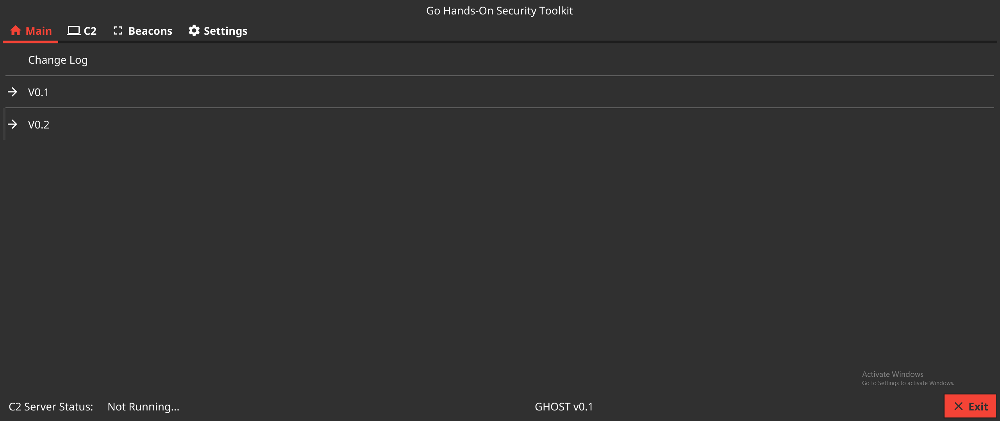
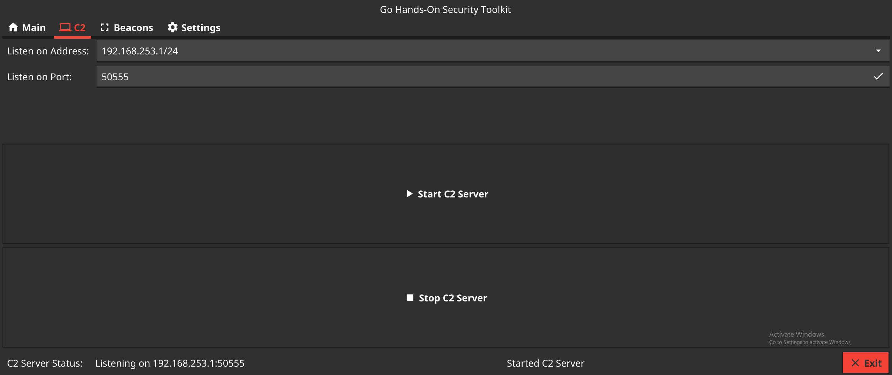
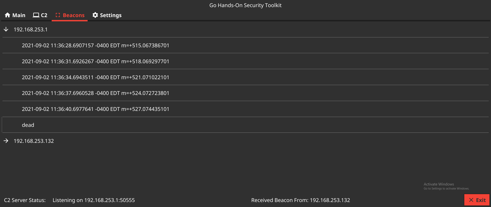

# C2 Server GUI for GHOST
### Easily view and manage beacons
* Simple UI
* Cross Platform
* [Integrated Beacons](https://github.com/bartimus-primed/implant)
* Implants and Interactivity coming soon...

Uses the amazing [Fyne GUI](https://fyne.io/) for the UI.

##### Main Screen

##### C2 Screen

##### Beacon Screen

